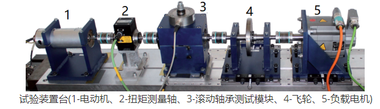
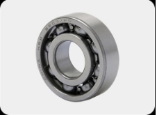
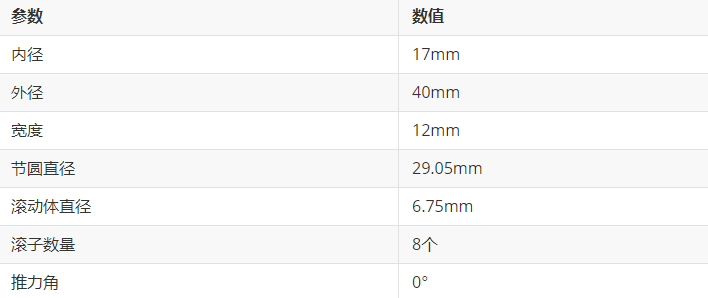
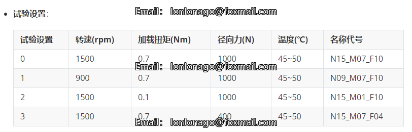
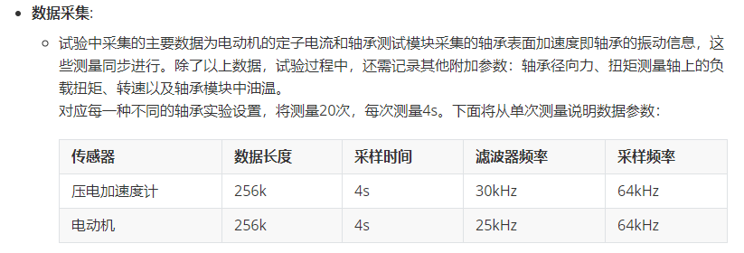
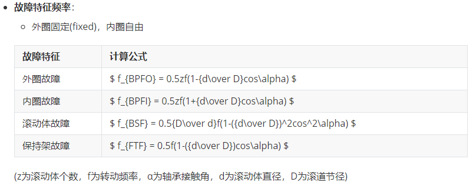
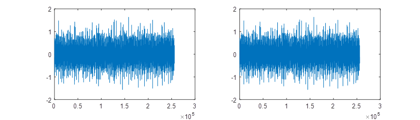
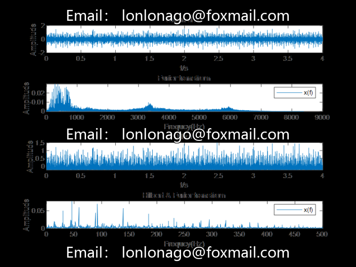
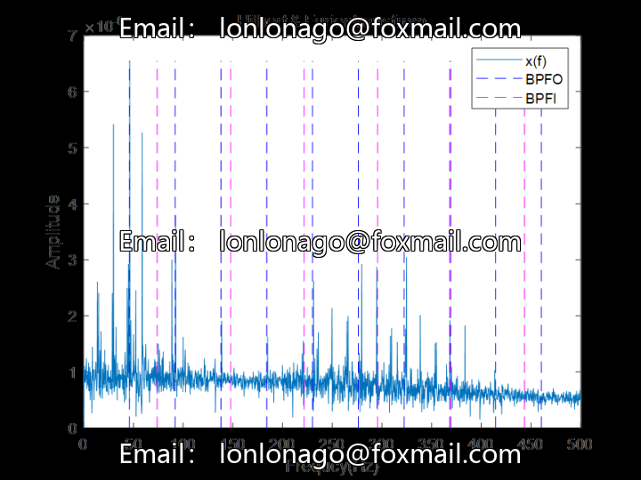

# Bearing Fault Diagnosis Based on Hilbert Envelope Modulation in MATLAB - Using Paderborn Bearing Data Set

## Experimental Device

The experimental data comes from the Paderborn bearing dataset in Germany. The test platform consists of an electric motor, torque measurement shaft, rolling bearing testing module, flywheel and load motor, etc. The bearing testing module can install different test bearings. The test platform collects the current signal of the motor under different working conditions and the vibration signal of the bearing housing. Operational parameters: rotational speed, radial force and load torque. Test settings: For each bearing, there are 4 sets of the same test settings, 3 main operational parameters have one set as a fixed level as the basic setting, which is used for one experiment; on the basis of the fixed level, change one parameter to get another 3 sets of experiments. During the measurement process, all operational parameters remain unchanged, but the temperature is also kept within a certain range throughout the experiment.

## Testing Bearings

The device can be installed to the bearing test module with bearing models 6203, N203, and NU203. The bearings tested in this experiment all use a 6203 type. The parameters of the 6203 are: The low-frequency (usually within hundreds of Hz) impact pulse caused by envelope demodulation of faults triggers high-frequency (thirty times the impact frequency) resonance waves. By envelope demodulation, detection, and low-pass filtering (i.e., demodulation), a resonant demodulated waveform corresponding to the low-frequency impact will be obtained. When a localized faulty bearing is running, it will generate impact pulses during operation, which then trigger the high-frequency inherent vibration of the bearing. This high-frequency inherent vibration becomes the carrier for the bearing and is modulated by the fault. Therefore, by demodulating the bearing's vibration signal, the characteristic frequencies of the fault can be detected in the modulation spectrum, allowing for the diagnosis of bearing fault types. Envelope demodulation of the bearing vibration signal can detect very weak impact fault signals, so it is relatively easy to identify the characteristic frequencies of the bearing faults. The method and implementation process are as follows: First, perform Hilbert transform on the raw data, then take the modulus of the data after Hilbert transform to obtain the envelope line, and finally perform Fourier transformation on it to obtain an envelope spectrum diagram, which can clearly reveal whether there are characteristic frequencies of faults, thereby diagnosing the state of the bearing fault.

## Dataset

https://mb.uni-paderborn.de/en/kat/main-research/datacenter/bearing-datacenter/data-sets-and-download

Original data is selected as N09_M07_F10_KB23_1.

clear,clc;
load("KB23\N09_M07_F10_KB23_1.mat");
fs = 64e3;
% Sampling frequency
T = 1/fs;
% Sampling period
lowpassF = 5e3;
% lowpass frequency
ogData = N09_M07_F10_KB23_1.Y;
% data
rpm = ogData(4).Data;
% rpm data
testdata = ogData(end).Data;
% vibratation data
signal = testdata;
subplot(121);
plot(testdata);
testdata = detrend(testdata);
subplot(122);
plot(testdata);
Demodulation and Band-Pass Filtering
[t,data,f,Fx,h_x,H_X] = fftandHfft(testdata,64e3);
% Band-pass filter
[H_X, f, xEnvOuterBpf, tEnvBpfOuter] = envspectrum(testdata, fs, ...
'FilterOrder', 200, 'Band', [fc-BW/2 fc+BW/2]);
Interval sidebands can be seen from the envelope spectrum.
Calculate fault characteristic frequency
%%
D=29.05;
d=6.75;
fr=mean(rpm)/60;
% Analyze using average speed
z=8;
%Roller Count
alpha=0;
bpfo = 0.5*z*fr*(1-d/D*cos(alpha));
bpfi = 0.5*z*fr*(1+d/D*cos(alpha));
bsf = 0.5*D/d*fr*(1-(d/D)^2*(cos(alpha))^2);
ftf = 0.5*fr*(1-d/D*cos(alpha));
Plotting envelope spectrum and fault characteristic frequency comparison line
Note:
1. All codes have been tested and there are no issues.
2. Please read the project description carefully before taking photos, as it is very important because it involves different programming languages (Python or MATLAB).
3. The program is for special items, and once sold cannot be returned or exchanged. If you have any issues, please contact us in a timely manner.
5. The code is not explained.
## Images

Here is a pay link on Stripe ( https://buy.stripe.com/3cs8yP7sY87d0vu9AB ). Please contact me lonlonago@foxmail.com after funding $89, and I will send you a complete data files , thank you!

